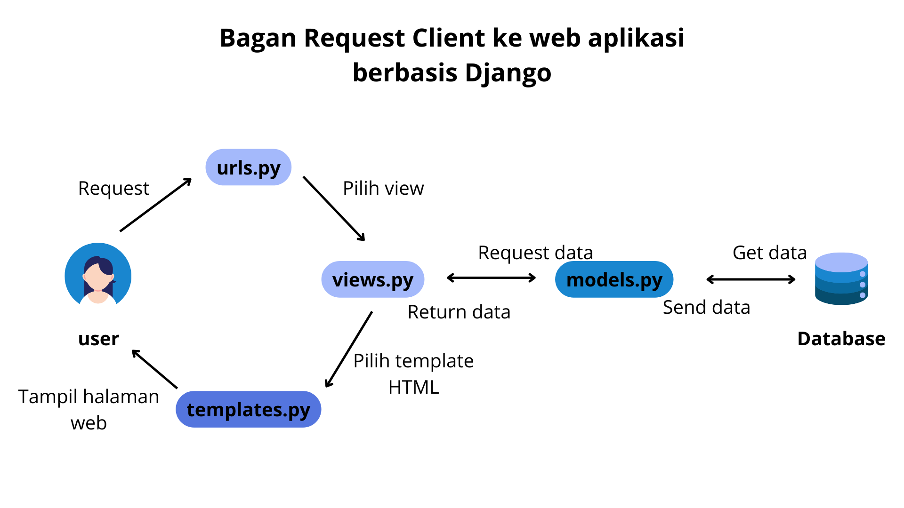
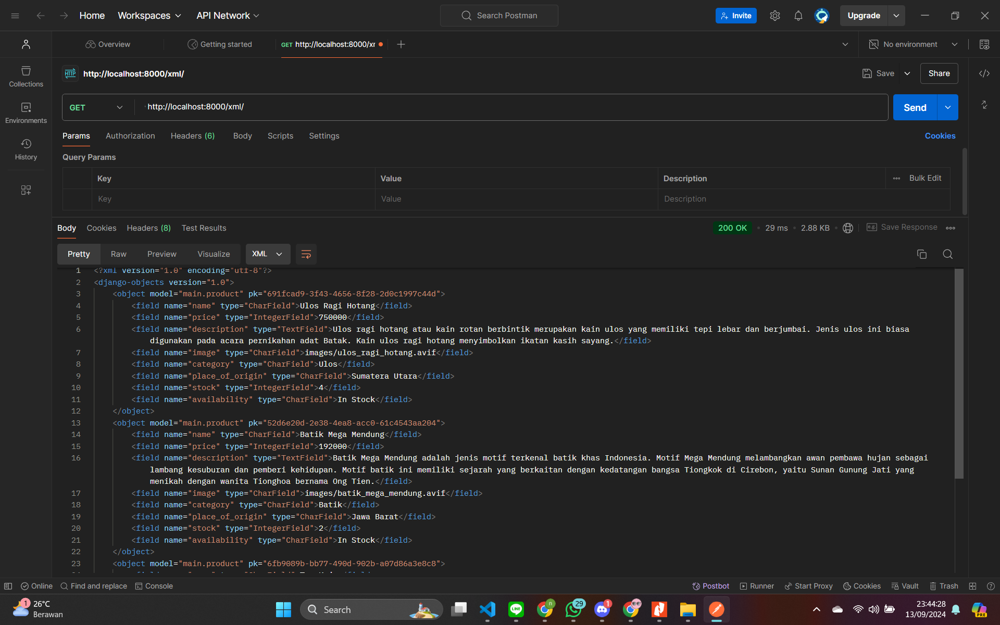
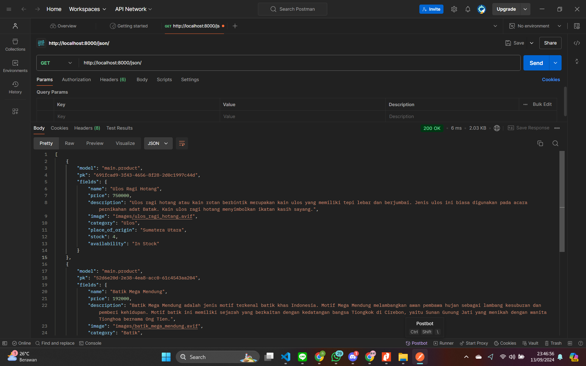
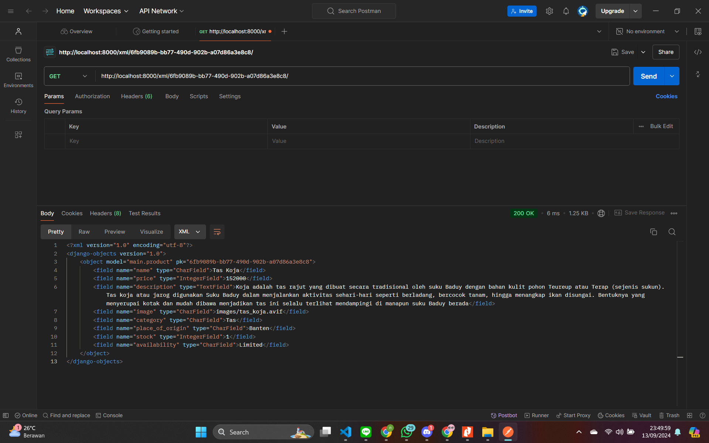
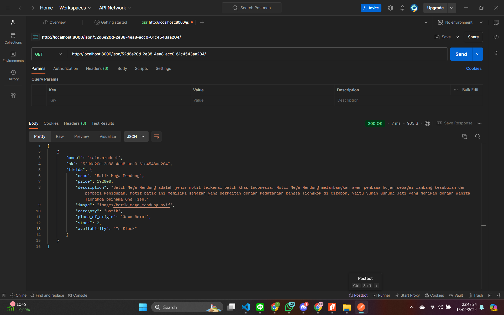

# heritage-craft
Nama: Namira Aulia
Tautan PWS: [heritagecraft](http://namira-aulia31-heritagecraft.pbp.cs.ui.ac.id/)


# (TUGAS 2)
## 1. Jelaskan bagaimana cara kamu mengimplementasikan checklist secara step-by-step
## Membuat proyek django baru
- Langkah pertama yang saya lakukan untuk mengimplementasikan checklist tugas 2 ini adalah mulai dari ``membuat direktori baru`` di lokal dengan nama "heritage-craft" kemudian direktori "heritage-craft" tersebut dibuka melalui command prompt untuk membuat virtual environment dan mengaktifkannya. 

- Selanjutnya saya mengkonfigurasi git agar direktori lokal dapat terhubung dengan git project dengan perintah ``git init``.

- Kemudian, saya menambahkan berkas bernama ``requirements.txt`` pada direktori "heritage-craft" dan menambahkan dependencies pada berkas requirements.txt. Kemudian saya memasang dependencies tersebut dan membuat proyek Django baru dengan nama "heritage_craft" dengan perintah django-admin startproject heritage_craft . . 

- Setelah itu saya membuat ``repositori baru`` di github agar dapat dihubungkan dengan direktori lokal. Repositori baru ini saya namakan heritage-craft

- Setelah itu saya menambahkan ``ALLOWED_HOSTS`` di ``settings.py`` menjadi ["localhost", "127.0.0.1"] yang berfungsi sebagai daftar host yang diizinkan untuk mengakses aplikasi web.

- Sebelum dapat menghubungkan ke github saya membuat branch utama baru dengan menjalankan perintah ``git branch -M main`` dan kemudian menghubungkan direktori lokal dengan repositori dengan perintah ``git remote add origin https://github.com/naamiraa/heritage-craft.git``

- Saya mengecek apakah project yang telah saya rencanakan berjalan maka saya ``mengaktifkan environment`` dan ``python manage.py runserver`` di direktori proyek untuk menjalankan server. Saya mengakses http://localhost:8000 yang terdapat animasi rocket yang berarti proyek Django telah berhasil dibuat. Ctrl+C untuk menghentikan server.

- Setelah memastikan project saya terhubung maka saya melakukan ``git add .``, ``git commit -m <komentar>`` , dan ``git push -u origin main`` untuk menyimpan isi direktori lokal ke github

## Membuat Aplikasi dengan nama main pada proyek heritage_craft
- Pertama - tama saya menjalankan perintah ``"python manage.py startapp main"`` pada proyek heritage_craft untuk membuat aplikasi baru. 

- Kemudian saya mendaftarkan aplikasi main tersebut ke proyek dengan cara menambahkan `main` ke dalam daftar INSTALLED_APPS pada berkas ``settings.py`` dalam direktori heritage_craft

## Melakukan routing pada proyek agar dapat menjalankan aplikasi main
- Melakukan routing pada proyek agar dapat menjalankan aplikasi main yaitu mengedit berkas `urls.py` pada direktori heritage_craft dan mengimpor fungsi include dari django.urls

- Kemudian menambahkan rute URL seperti berikut untuk mengarahkan ke tampilan main di dalam variabel urlpatterns

```python
urlpatterns = [
    ...
    path('main/', include('main.urls')),
]
```

## Membuat model pada aplikasi main dengan nama Product
- untuk membuat model pada aplikasi main dengan nama ``product`` dan memiliki atribut wajib yaitu ``name``, ``price``, dan ``description`` serta menambahkan beberapa atribut yang saya inginkan, langkah pertama adalah membuka berkas ``models.py`` pada direktori aplikasi ``main`` dan isi berkas tersebut dengan kode berikut

```python
from django.db import models

# Create your models here.
class Product(models.Model):
    name = models.CharField(max_length=255)
    price = models.IntegerField()
    description = models.TextField()
    stock = models.IntegerField()
    # Kain batik, ulos, tenun, & berbagai kerajinan tangan
    category = models.CharField(max_length=100)
    # daerah asal
    place_of_origin = models.CharField(max_length=100)
    # tanggal penambahan produk
    date = models.DateField(auto_now_add=True)
```

- Karena saya memodifikasi berkas ``models.py`` maka selanjutnya saya melakukan migrasi skema model ke database Django dengan menggunakan perintah ``python manage.py makemigrations`` untuk persiapan migrasi dan ``python manage.py migrate`` untuk menerapkan skema model.

## Membuat sebuah fungsi pada views.py untuk dikembalikan ke dalam sebuah template html yang menampilkan nama aplikasi serta nama dan kelas
- Langkah yang saya lakukan adalah dengan membuka berkas ``views.py`` yang ada di dalam aplikasi main dan menambahkan kode berikut:
```python
from django.shortcuts import render
kemudian menambahkan fungsi show_main:
def show_main(request):
    context = {
        'name': 'Namira Aulia',
        'class': 'PBP C'
    }

    return render(request, "main.html", context)
```

- Kemudian pada berkas ``main.html`` yang ada di dalam direktori templates saya menambahkan nama app, npm, nama, dan class menjadi struktur Django yang sesuai untuk menampilkan data

## Membuat routing pada urls.py pada apliasi main untuk memetakan fungsi yang telah dibuat pada views.py 
- Membuat sebuah routing pada ``urls.py`` di aplikasi main untuk memetakan ungsi yang telah dibuat pada ``views.py``. Saya membuat file ``urls.py`` di dalam direktori ``main`` dan mengisinya dengan kode berikut:
```python
from django.urls import path
from main.views import show_author

app_name = 'main'

urlpatterns = [
    path('', show_author, name='show_author'),
]
```

## Melakukan deployment ke PWS
Sebelum melakukan deployment ke PWS terlebih dulu syaa melakukan perintah python manage.py runserver yang kemudian dibuka pada http://localhost:8000/main untuk memastikan web dapat diakses. Kemudian saya memulai proses deployment pada PWS dengan langkah berikut:
- Karena saya telah memiliki akun pada PWS langkah pertama yang saya lakukan hanyalah memulai dengan 'create new project'
- Memberi project name kemudian klik create new project
- Menyimpan informasi project credentials dan project command
- Pada ``settings.py`` di proyek Django, saya menambahkan URL deployment pada ``ALLOWED_HOSTS`` yaitu namira-aulia31-heritagecraft.pbp.cs.ui.ac.id
- Menjalankan perintah yang terdapat pada project command halaman PWS
- Menjalankan perintah ``git branch -M main`` untuk kembali mengubah nama branch ke main
- Menunggu status deployment hingga success


## 2. Bagan yang berisi request client ke web aplikasi berbasis Django beserta responnya dan jelaskan pada bagan tersebut kaitan antara urls.py, views.py, models.py, dan berkas html.


- Pertama client akan mengirimkan permintaan (HTTP Request) melalui melalui browser untuk mengakses halaman web, lalu permintaan ini akan diteruskan ke sistem routing yang dikelola Django untuk mencari pola URL yang sesuai dengan request tersebut. 
- Setelah menemukan pola URL yang cocok, Django akan memanggil fungsi yang terkait dalam berkas views.py.
- Setelah itu, views.py akan mengatur berbagai macam bentuk interaksi agar di dalam models.py dapat mengelola dan menyajikan data yang telah diolah oleh models.py dapat ditampilkan pada templates dalam berkas html. 
- Setelah semua operasi selesai, fungsi yang sesuai dalam berkas views.py akan menghasilkan halaman web yang diminta oleh client dalam formt HTML yang dapat disebut dengan template
- Berkas HTML akan disimpan dalam direktori ``templates``  untuk penggunaan selanjutnya
- Browser client akan merender berkas HTML ini sebagai respons (HTTP Response) dari server Django sehingga menghasilkan tampilan yang sesuai yang dapat dilihat oleh user.


## 3. Fungsi git dalam pengembangan perangkat lunak
Fungsi git dalam pengembangan perangkat lunak adalah:
- Versioning: Git menyimpan versi dari setiap perubahan yang dilakukan pada kode sehingga memudahkan developer untuk melacak perubahan
- Kolaborasi: Git memungkinkan kolaborasi antar developer dengan sistem branch dan merge untuk dapat mengintegrasikan pekerjaan masing - masing
- Backup: Jika terjadi kesalahan, git memungkinkan developer untuk dapat kembali ke versi kode sebelumnya (versi kode yang sesuai)


## 4. Mengapa framework Django dijadikan permulaan pembelajaran pengembangan perangkat lunak?
- Django menyediakan banyak fitur bawaan (seperti ORM, admin interface, dan form handling), yang mempermudah pemula memulai proyek tanpa memerlukan banyak konfigurasi eksternal.
- Django memiliki struktur yang jelas dan tergorganisir sehingga sesuai untuk dijadikan permulaan pembelajaran pengembangan perangkat lunak


## 5. Mengapa model pada Django disebut sebagai ORM?
Alasan model pada Django disebut sebagai ORM adalah karena Django memungkinkan untuk berinteraksi dengan database. Pada Django, ORM ini mampu menghubungkan  objek Python secara langsung ke tabel - tabel dalam database dan secara otomatis menangani query SQL di balik layar sehingga developer tidak perlu menulis query SQL secara manual


# (TUGAS 3)
## 1. Mengapa kita memerlukan data delivery dalam pengimplementasian sebuah platform?
Dalam pengimplementasian platfrom, data delivery (pengiriman data) adalah aspek yang penting karena sebuah platform biasanya terhubung dengan berbagai client (seperti web atau mobile app) dan server. Platform sering melibatkan beberapa layanan atau komponen yang memerlukan pertukaran data, seperti antara frontend dan backend, atau dari aplikasi ke database. Proses data delivery memungkinkan komunikasi antara client dan server, sehingga data seperti produk apa saja yang tersedia di ecommerce ini dapat dikirim dan diterima secara efisien. Selain itu, di masa modern sekarang sangat dibutuhkan aplikasi yang berbasis real-time artinya kebutuhan akan data delivery yang cepat dan akurat menjadi sangat penting untuk menjaga performa platform.

## 2. Mana yang lebih baik antara XML dan JSON? Mengapa JSON lebih populer dibandingkan XML?
JSON (JavaScript Object Notation) dan XML (eXtensible Markup Language) adalah dua format pertukaran data yang banyak digunakan. Berdasarkan sumber yang saya baca, berikut adalah perbandingan antara XML dan JSON:
1. XML
    - XML lebih kompleks karena memiliki struktur dengan elemen - elmen yang lebih panjang
    - XML lebih fleksibel karena bisa mengakomodasi format data yang lebih kompleks (misalnya data dengan atribut)
    - XML bisa menggabungkan skema untuk validasi data
2. JSON
    - JSON lebih mudah dibaca dan sedergana karena struktur datanya lebih ringkas dan mirip dengan objek JavaSCript
    - JSON sering kali lebih efisien dalam hal ukuran data yang dikirim karena tidak menggunakan tag penutup seperti XML
    - JSON diintegrasikan secara native dengan JavaSCript yang menjadikannya lebih cepat dan praktis dalam aplikasi web modern
Berdasarkan perbandingan di atas, menurut saya JSON lebih baik salah satu alasannya karena JSON lebih mudah dibaca dan ditulis, baik oleh mesin maupun manusia, karena menggunakan format key-value yang langsung. XML menggunakan tag yang lebih kompleks. Namun, XML masih relevan untuk kasus di mana diperlukan fitur-fitur seperti validasi skema (XML Schema) atau ketika menangani data dengan struktur yang sangat kompleks.

JSON lebih populer karena sederhana dan lebih mudah diproses di sisi client (khususnya di aplikasi web yang banyak menggunakan JavaScript). JSON juga lebih hemat dalam ukuran file dan lebih mudah dibaca oleh manusia dibandingkan dengan XML. Dalam aplikasi web dan API modern, JSON lebih disukai karena lebih mudah di-parse oleh mesin dan lebih mudah diintegrasikan dalam berbagai bahasa pemrograman.

## 3. Fungsi dari method ``is_valid()`` pada form DJango dan mengapa membutuhkan method tersebut?
Method ``is_valid()`` pada form Django digunakan untuk memvalidasi data yang diinput oleh pengguna. Fungsi ini akan mengecek apakah semua data yang diisi di form memenuhi kriteria validasi yanng telah ditentukan seperti apakah tipe data sesuai, apakah ada field yang belum terisi. 

Kita memerlukan ``is_valid()`` untuk memastikan bahwa data yang dikirim ke aplikasi adalah benar dan sesuai sebelum diolah lebih lanjut. Hal ini perlu untuk mencegah kesalahan dalam aplikasi yang disebabkan data yang tidak valid. Jika data tidak valid, Django akan secara otomatis mengembalikan pesan kesalahan yang dapat digunakan untuk memberi tahu pengguna tentang apa yang salah.

## 4. Mengapa kita membutuhkan ``csrf_token`` saat membuat form di Django? Apa yang dapat terjadi jika kita tidak menambahkan ``csrf_token`` pada form Django? Bagaimana hal tersebut dapat dimanfaatkan oleh penyerang?
CSRF (Cross-Site Request Forgery) adalah serangan di mana penyerang bisa membuat pengguna yang sudah terautentikasi melakukan tindakan yang tidak diinginkan di aplikasi web tanpa sepengetahuan mereka, seperti mengirimkan permintaan berbahaya ke server. ``csrf_token`` diperlukan pada form di Django untuk melindungi aplikasi dari serangan Cross-Site Request Forgery (CSRF). ``csrf_token`` memastikan bahwa form yang di-submit berasal dari sumber yang sah (pengguna aplikasi itu sendiri) dan bukan dari situs atau sumber berbahaya. Dengan adanya token ini, server dapat memverifikasi bahwa permintaan POST atau perubahan data berasal dari pengguna yang sah dan bukan dari pihak luar yang berbahaya.

Jika form tidak dilindungi oleh ``csrf_token``, penyerang dapat memanfaatkan form tanpa token untuk memodifikasi data, menghapus informasi, atau melakukan tindakan yang menguntungkan penyerang, seperti mencuri uang atau informasi.

Penyerang dapat mengirim permintaan dari situs eksternal atau skrip yang menyebabkan pengguna secara tidak sengaja melakukan aksi di situs yang mereka kunjungi, seperti mentransfer uang atau menghapus data, tanpa menyadari tindakan tersebut. Dengan adanya ``csrf_token``, setiap permintaan POST dari form harus menyertakan token unik yang hanya diketahui oleh server dan client yang sah. Jika token ini tidak ada atau tidak cocok, permintaan akan dianggap tidak valid dan ditolak, sehingga melindungi aplikasi dari serangan CSRF.


## 5. Cara mengimplementasikan checklist tugas secara step - by step
1. Memastikan struktur direktori & repositori heritage-craft sudah sesuai 
2. Membuat skeleton terlebih dahulu sebagai kerangka views dengan cara membuat direktori ``template`` pada ``root folder`` dan menambahkan berkas baru bernama ``base.html`` serta mengisinya dengan kode yang telah dijelaskan pada tutorial 2
3. Membuka settings.py dan menambahkan kode berikut agar berkas ``base.html`` terdeteksi sebagai templates
```python
TEMPLATES = [
    {
        'BACKEND': 'django.template.backends.django.DjangoTemplates',
        'DIRS': [BASE_DIR / 'templates'], # Tambahkan konten baris ini
        'APP_DIRS': True,
        ...
    }
]
```
3. Memperbarui isi file ``main.html`` yang ada pada direktori main agar menggunakan ``base.html`` sebagai template utama
4. Mengubah primary key dari integer menjadi UUID pada ``models.py`` agar mencegah adanya kerentanan terhadap keamanan aplikasi
5. Melakukan migrations karena terdapat perubahan pada ``models.py``
6. Membuat form input data dan menampilkan product pada HTML dengan cara berikut:
    - Pertama saya membuat berkas baru pada direktori ``main`` dengan nama ``forms.py`` untuk membuat struktur form yang dapat menerima data Product baru. 
    - Menambahkan import redirect pada file ``views.py`` 
    - Saya juga menambahkan function baru dengan nama ``create_product_entry`` yang menerima parameter ``request`` pada berkas ``views.py``. 
    - Mengubah fungsi ``show_main`` yang ada pada file ``views.py`` dengan menambahkan variabel ``product_entries``valuenya adalah ``Product.objects.all()`` yang digunakan untuk mengambil seluruh objek ``Product`` yang tersimpan pada database
    - Membuka ``urls.py`` pada direktori ``main`` dan import fungsi create_product_entry yang telah saya buat sebelumnya dan menambahkan path tersebut ke ``urlpatterns`` pada ``urls.py``
    - Membuat berkas HTML baru dengan nama ``create_product_entry`` pada direktori ``main/templates`` dan mengisi kode dengan block untuk form dengan metode POST, token, template tag yang digunakan untuk menampilkan fields form yang sudah dibuat tadi, dan juga tombol submit untuk kirim request ke view ``create_product_entry(request)``
    - Menambahkan kode dalam block contect main.html untuk menampilkan data product dalam bentuk tabel serta tombol "Add New Product Entry"
    - Setelah itu tentunya saya mencoba menjalankan perintah runserver untuk mengecek apakah aplikasi dapat berjalan sesuai rencana awal. Karena bentuk aplikasi sudah sesuai rencana maka saya menambahkan 3 data product baru dan data yang saya input berhasil ditampilkan pada halaman utama aplikasi
    - Melakukan git add, commit, push 
7. Menambahkan 4 fungsi views baru untuk melihat objek yang sudah ditambahkan dalam format XML, JSON, XML by ID, dan JSON by ID dan membuat routing URl untuk masing - masing views dengan langkah berikut:
    - Menambahkan import ``HttpResponse`` dan ``Serializer`` pada bagian paling atas berkas ``views.py``
    - Membuat function baru yang menerima parameter request dengan nama ``show_XML`` dan membuat sebuah variabel yang menyimpan query dari seluruh data yang ada pada ``Product`` seperti berikut:
    ```python
            {
                def show_xml(request):
                    data = Product.objects.all()
                    return HttpResponse(serializers.serialize("xml", data), content_type="application/xml")
            }
    ```
    - Menambahkan import fungsi yang telah dibuat (show_XML) ke dalam ``urls.py`` dan menambahkan path url ke dalam ``urlpatterns`` seperti berikut:
        ```python
            {
            ...
            path('xml/', show_xml, name='show_xml'),
            ...
            }
        ```
    - Coba menjalankan proyek Django dengan perintah ``python manage.py runserver`` dan membuka local host yang ditambahkan path xml/ serta memastikan data yang ada sesuai dengan objek yang telah saya tambahkan sebelumnya
    - Saya melakukan hal yang sama (mulai bullet 2 - 4) untuk format JSON dengan menyesuaikan nama function, variabel, contect_type, serta path yang digunakan agar sesuai dengan ketentuan format JSON
    - Untuk format XML_by_ID dan JSON_by_ID saya menambahkan parameter pada functionnya yaitu menjadi ``def show_xml_by_id(request, id)``
    - Saya juga mengubah method yang digunakan pada variabel data menjadi  ``data = Product.objects.filter(pk=id)`` 
    - Import fungsi ``show_xml_by_id`` dan ``show_json_by_id`` pada ``urls.py`` dan juga menambahkan path URL ke ``urlpatterns``
    - Cek proyek Django dengan runserver
8. Menggunakan Postman sebagai Data Viewer
    - Setelah saya memastikan proyek sudah berjalan aman di localhost, selanjutnya saya mencoba cek url dengan mengirimkan request baru dengan method get ke postman untuk mengetes apakah data terkirimkan dengan baik
    - Memastikan data yang ditampilkan sesuai ketika jalan di localhost
    - Screenshot untuk masing - masing request URL dan menyimpan screenshot tersebut di folder ``static/images`` agar dapat dengan mudah ditambahkan pada README.md
9. Melakukan ``add-commit-push`` ke github

## Screenshot hasil akses URL dalam format XML pada Postman


## Screenshot hasil akses URL dalam format JSON pada Postman


## Screenshot hasil akses URL dalam format XML_by_ID pada Postman


## Screenshot hasil akses URL dalam format JSON_by_ID pada Postman



# (TUGAS 4)
## 1. Perbedaan antara ``HttpResponseRedirect()`` dan ``redirect()``
Dilansir dari stackoverflow, jika ``HttpResponseRedirect()`` argumen pertama hanya dapat berupa url, nanti fungsi tersebut akan melakukan redirect sesuai parameter yang dimasukkan. Sedangkan argumeb yang dimasukkan pada ``Redirect()`` dapat berbeda - beda dapat menerima model, view, atau url sebagai argumennya jadi sedikit lebih fleksibel dalam hal apa yang dapat "dialihkan".


## 2. Cara kerja penghubungan model ``Product`` dengan ``User``
Penghubungan model Product dengan User di Django dilakukan dengan menggunakan relasi ForeignKey. Artinya, setiap produk yang dibuat akan terkait dengan pengguna yang membuatnya. Kemudian mengisi field user dengan objek dari request user yang sedang ter-authorization. Selanjutnya kita dapat menyaring seluruh objek dengan hanya mengambil products dimana field user terisi dengan objek user yang sama dengan pengguna yang login pada waktu yang sama. Dengan demikian, hanya produk yang dimiliki oleh pengguna yang sedang login yang akan diambil.

## 3. Perbedaan antara authentication dan authorization, apakah yang dilakukan saat pengguna login? Jelaskan bagaimana Django mengimplementasikan kedua konsep tersebut
Berdasarkan ppt PBP terkait form, authentication, session, and Cookie dan juga penjelasan di kelas, perbedaan antara authentication dan authorization adalah jika autentikasi adalah proses memverifikasi siapa yang login sedangkan autorisasi adalah proses memverifikasi akses apa saja yang dapat dilakukan oleh user tersebut.

Autentikasi adalah proses memverifikasi identitas pengguna. Biasanya dengan cara memasukkan username dan juga password di form login. Di Django, authentication dilakukan saat pengguna login melalui ``django.contrib.auth.authenticate()`` yang memverifikasi kredensial pengguna (biasanya username dan password)

Sedangkan authorization adalah proses menentukan hak akses pengguna. Authorization terjadi setelah proses autentikasi, yaitu menentukan apakah pengguna yang telah terautentikasi memiliki hak untuk melakukan tindakan tertentu atau mengakses resourses tertentu. Misalnya apakah pengguna dapat mengakses halaman admin atau mengubah data. Authorization di Django pada proyek ini ditangani dengan sistem ``@login_required(login_url='/login')`` agar halaman main hanya dapat diakses oleh pengguna yang sudah login (terautentikasi).

Saat user login maka:
- Django akan menjalankan authentication dengan mencocokkan username dan password dengan data yang ada di database
- Jika berhasil, Django akan mengatur session untuk menyimpan informasi pengguna yang telah login. Setelah itu, berdasarkan apa saja yang dapat diakses, Django akan melakukan authorization untuk memastikan pengguna memiliki izin mengakses halaman tertentu yang sesuai. 

## 4. Bagaimana Django mengingat pengguna yang telah login? Jelaskan kegunaan lain dari cookies dan apakah semua cookies aman digunakan?
- Bagaimana Django mengingat pengguna yang telah login?
    - Berdasarkan dengan apa yang telah dijelaskan saat kelas, Setelah pengguna login berhasil, Django membuat session. Session ini disimpan baik di server (misalnya di database) dan di client-side melalui cookies. Cookie yang digunakan untuk menyimpan session ID adalah ``sessionid``
    - Setiap kali pengguna melakukan request baru, cookie sessionid ini dikirimkan ke server, dan server memverifikasi session tersebut untuk mengingat siapa pengguna yang sedang login

- Kegunaan lain dari cookies:
    Dilansir dari glints.com, berikut adalah beberapa fungsi dari cookies pada website:
    - Menyimpan informasi login
    - Menyediakan konten dan referesni yang personal
    Melansir Hitechwhizz, cookies adalah teknologi dalam situs yang mampu menyediakan konten dan referensi kepada para user.
    Sebagai contoh, cookies akan mengingat jenis konten yang sering kita lihat hingga pilihan fitur favorit kita
    - Mengingat pengaturan situs
    Cookies kan mengingat preferensi bahasa, mode warna, hingga resolusi yang dipilih oleh pengguna dalam situs.
    Jadi, nantinya, saat pengguna mengakses kembali website tersebut, ia secara otomatis akan menyediakan pengaturan yang sesuai dengan pilihan sebelumnya.
    - Targeting iklan
    Sebagian besar perusahaan, khususnya, situs e-commerce cenderung menggunakan cookies untuk menargetkan produk ke pelanggan mereka. Informasi seperti istilah pencarian, keyword, dan lokasi geografis dikumpulkan untuk kampanye pemasaran mereka.

- Apakah semua cookies aman digunakan?
Tidak semua cookies aman. Potensi masalah dari cookies bisa seperti XSS (Cross-site Scripting): Jika cookie dapat diakses oleh skrip berbahaya, informasi sensitif seperti session bisa dicuri.

## 5. Cara mengimplementasikan checklist
### Membuat implementasi register
Pertama yang saya lakukan adalah menambahkan import ``UserCreationForm`` pada ``views.py`` yang memudahkan pembuatan formulir pendaftaran pengguna dalam aplikasi web. Setelah itu menambahkan fungsi register yang  berfungsi untuk menghasilkan formulir registrasi secara otomatis dan menghasilkan akun pengguna ketika data di-submit dari form. Kemudian membuat berkas baru dengan nama ``register.html`` pada direktori ``main/templates``dan juga menambahkan path url ke dalam ``urlpatterns`` yang ada di ``urls.py`` pada subdirektori ``main`` untuk mengakses fungsi register. 

### Membuat implementasi login
Pada ``views.py`` saya melakukan import ``authenticate``, ``login``, dan ``AuthenticationForm`` yang dapat digunakan untuk melakukan autentikasi dan login (jika autentikasi berhasil) serta menambahkan fungsi baru dengan nama ``login_user`` . Kemudian membuat berkas baru dengan nama ``login.html`` pada folder ``main/templates``. Setelah itu import fungsi yang telah ditambahkan ke views.py tadi ke dalam ``urls.py`` dan menambahkan path url ke dalam ``urlpatterns``
Saya juga membatasi akses ke halaman main agar hanya dapat diakses oleh pengguna yang sudah login dengan menambahkan ``@login_required(login_url='/login')`` di atas fungsi show_main pada views.py

### Membuat implementasi logout
Pada ``views.py`` saya melakukan import ``logout`` serta menambahkan fungsi baru dengan nama ``logout_user`` dengan kode berikut:
```python
        {
def logout_user(request):
    logout(request)
    return redirect('main:login')
        }
```
``logout(request)`` digunakan untuk menghapus sesi pengguna yang saat ini masuk dan ``return redirect('main:login')`` mengarahkan user untuk ke halaman login dalam aplikasi Django.
Kemudian pada berkas ``main.html`` saya menambahkan button logout di bagian paling bawah untuk mengarahkan ke URL berdasarkan app_name dan name yang sudah didefinisikan di urls.py 
```python
        {
...
<a href="">
  <button>Logout</button>
</a>
...
        }
```
Setelah itu import fungsi logout_user yang telah ditambahkan ke views.py tadi ke dalam ``urls.py`` dan menambahkan path url ke dalam ``urlpatterns``

### Implementasi Cookies dan last login
Import ``datetime``, ``HttpsResponseRedirect``, dan ``reverse`` kemudian menambahkan fungsionalitas cookies di fungsi ``login_user`` pada ``views.py`` agar setiap login datanya disimpan di cookies dan dapat diakses. Lalu, saya menambahkan potongan kode ``'last_login': request.COOKIES['last_login']`` ke dalam variable context pada fungsi show_main dan juga mengubah fungsi ``logout_user`` menjadi berikut:
```python
        {
def logout_user(request):
    logout(request)
    response = HttpResponseRedirect(reverse('main:login'))
    response.delete_cookie('last_login')
    return response
        }
```
``response.delete_cookie('last_login')`` berfungsi untuk menghapus cookie last_login saat pengguna melakukan logout
Setelah itu, saya menambahkan informasi sesi terakhir login pada bagian setelah button logout pada file ``main.html``

### Menghubungkan Model Product dengan User
Import ``from django.contrib.auth.models import User`` pada ``models.py`` dan menambahkan kode berikut pada model Product yang berfungsi untuk menghubungkan satu product dengan satu user melalui sebuah relationship, dimana sebuah Product pasti terasosiasikan dengan seorang user.
```python
        {
class MoodEntry(models.Model):
    user = models.ForeignKey(User, on_delete=models.CASCADE)
    ...
        }
```
Lalu, mengubah fungsi create_product_entry menjadi berikut:
```python
        {
def create_product_entry(request):
    form = Product(request.POST or None)

    if form.is_valid() and request.method == "POST":
        product_entry = form.save(commit=False)
        product.user = request.user
        product_entry.save()
        return redirect('main:show_main')

    context = {'form': form}
    return render(request, "create_product_entry.html", context)
 ...
        }
```
kemudian mengubah value ``product`` menjadi ``product_entries = Product.objects.filter(user=request.user)`` nam variable ``name`` pada context diubah menjadi ``'name' : request.user.username,``

Setelah semua proses di atas, kemudian saya melakukan makemigrations dan juga migrate untuk merefleksikan perubahan serta mengganti value dari variabel debug pada settings.py. Terakhir, saya membuat akun baru dan menambahkan beberapa product baru untuk memastikan bahwa product yang telah saya buat di akun sebelumnya tidak akan ditampilkan di halaman user yang baru saja saya buat. 

Langkah terakhir pada tugas 4 ini, saya melakukan add, commit, dan push ke github